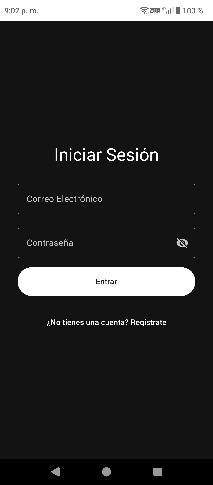
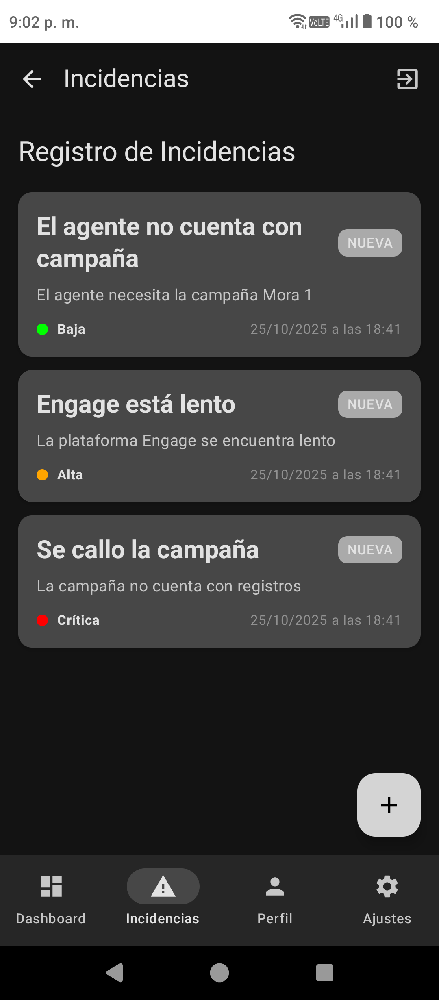

# 📊 Dashboard Móvil — Torre de Control en Cobranza

Aplicación móvil desarrollada en **Kotlin** con **Jetpack Compose** para **Coppel**, que centraliza en tiempo real los **indicadores clave (KPIs)** de la operación de cobranza, optimizando la supervisión y reduciendo los tiempos de respuesta ante incidencias.
Su objetivo es ofrecer una herramienta móvil intuitiva para que supervisores y gestores accedan rápidamente a métricas críticas de desempeño.

---

## 🧭 Contexto del Proyecto

Coppel, empresa del sector retail y financiero, maneja diariamente miles de operaciones de cobranza.
Actualmente, la información sobre indicadores y alertas se encuentra dispersa en distintas plataformas, lo que retrasa la toma de decisiones y dificulta la gestión de incidencias.

👉 **Oportunidad:** Centralizar la información de cobranza en un solo dashboard móvil con actualizaciones automáticas, métricas visuales y accesibilidad desde cualquier lugar.

---

## 🚀 Estado Actual del Proyecto

### ✅ FUNCIONALIDADES IMPLEMENTADAS
- Sistema de **autenticación y registro de usuarios** con persistencia de sesión.
- **Roles de usuario** (Administrador / Usuario) asignados durante el registro.
- **Formulario de registro extendido** (número de empleado, puesto, empresa, ciudad).
- Pantalla de **perfil de usuario** enriquecida con la nueva información laboral.
- Base de datos local con **Room** y **SQLite**, gestionada con interfaces y repositorios.
- **Dashboard principal** con visualización de KPIs.
- **Actualización automática** de KPIs cada 5 segundos con datos simulados.
- Gráficas interactivas y dinámicas con **Vico Charts**.
- **Gestión de incidencias** con CRUD completo (Crear, Leer, Actualizar, Eliminar).
- **Arquitectura reactiva** con ViewModels compartidos para actualizaciones en tiempo real.
- **Navegación modular** con Jetpack Navigation Compose.
- **Inyección de dependencias** robusta con Hilt/Dagger.

### 🛠️ EN DESARROLLO
- Optimización de rendimiento en la carga inicial de datos.
- Pruebas unitarias para ViewModels y Repositorios.
- Ajustes visuales finales en temas y tipografía.

---

### 🧩 Patrón Arquitectónico
**MVVM + Principios de Clean Architecture**
- **UI Layer:** Jetpack Compose, State Hoisting.
- **Domain/ViewModel Layer:** StateFlow, Coroutines, ViewModels compartidos.
- **Data Layer:** Patrón Repositorio, Room, DataStore.

---

## ⚙️ Stack Tecnológico

| Categoría | Tecnologías |
|------------|--------------|
| 💙 **Lenguaje & Framework** | Kotlin, Jetpack Compose, Material Design 3 |
| 🏗️ **Arquitectura & Patrones** | MVVM, Clean Architecture, StateFlow, DI |
| 💾 **Persistencia de Datos** | Room, DataStore, SQLite |
| 🔄 **Programación Asíncrona** | Coroutines, Flow |
| 📊 **Visualización de Datos** | Vico Charts, Canvas de Compose |
| 💉 **Inyección de Dependencias** | Hilt/Dagger |

---

## 📈 KPIs Implementados

| Indicador | Estado | Tecnología | Frecuencia |
|------------|---------|-------------|-------------|
| 💰 **Eficiencia de Cobranza** | ✅ Implementado | Vico Column Chart | Cada 5 seg |
| ⏱️ **Tiempo de Resolución** | ✅ Implementado | Room + Compose | Cada 5 seg |
| 👥 **Clientes Gestionados** | ✅ Implementado | Datos en UI | Cada 5 seg |
| 📉 **Nivel de Morosidad** | ✅ Implementado | Datos en UI | Cada 5 seg |
| 🎯 **Cumplimiento de Atención** | ✅ Implementado | Datos en UI | Cada 5 seg |
| 👥 **Satisfacción del Cliente** | ✅ Implementado | Datos en UI | Cada 5 seg |
---

## 🔐 Sistema de Roles

### 👨‍💼 Administrador
- Acceso completo a todas las funciones.
- CRUD completo en la gestión de incidencias.
- Descarga de reportes en formato PDF.

### 👥 Usuario Estándar
- Visualización de dashboards e indicadores.
- Creación y seguimiento de sus propias incidencias.
- Acceso limitado a funciones de edición y eliminación.

---

## 📱 Pantallas Principales

1. **Inicio de Sesión** → Autenticación con email y contraseña.
2. **Registro de Usuario** → Creación de nueva cuenta con datos personales y laborales.
3. **Dashboard Principal** → Vista general de KPIs con semaforización (verde/amarillo/rojo).
4. **Detalle de KPI** → Análisis específico de cada indicador con métricas detalladas y gráficas.
5. **Gestión de Incidencias** → CRUD completo para administradores.
6. **Detalle de Incidencia** → Información específica y seguimiento de cada caso.
7. **Perfil de Usuario** → Datos personales, laborales y botón para cerrar sesión.
8. **Configuración** → Personalización de la app (en desarrollo).

---
## 🧩 Ejemplo Visual

| Login | Dashboard | Incidencias | Perfil | Configuración |
|:------:|:-----------:|:------------:|:---------:|:--------------:|
|  |  |  |  |  |

---

## 📲 Descargar APK

### 🎯 **Versión Actual: 1.0.2**

## 🧾 Requisitos del Sistema

### 🛠️ Para Desarrollo
- **Android Studio Giraffe** o superior
- **SDK Android API 23+** (Android 6.0 Marshmallow)
- **Kotlin 1.9+**
- **Gradle 8.0+**
- **JDK 17+**

### 📱 Para Ejecución
- **Dispositivo o emulador** con Android 6.0+
- **RAM mínima:** 2GB
- **Almacenamiento:** 50MB libres

---

## 🐛 Solución de Problemas Recientes

### ✅ CORREGIDOS
### 🎨 Mejoras de Interfaz y Usabilidad
- **Legibilidad en Tema Claro:** Solucionado problema de texto casi invisible en pantalla "Novedades de la Versión"
- **Colores de Botones:** Corregido color de botones de acción destructiva para consistencia en todos los temas
- **Contraste en Diálogos:** Mejorado contraste de texto e iconos en diálogos de confirmación
- **Formulario Login/Registro:** Diseño corregido para coincidir con diseño original

### 🚀 Correcciones Técnicas
- **Compatibilidad:** Solucionado error que impedía apertura en algunos dispositivos
- **Pantalla KPI:** Corregido bug visual que ocultaba valores numéricos en detalle de KPI
- **Formulario Incidencias:** Campo "Estado" ahora se muestra correctamente
- **Control de Accesos:** Usuarios no-administradores ya no ven botón de añadir incidencias

### 🔧 Optimizaciones de Código
- **Referencias:** Solucionados errores de "Unresolved reference" en toda la aplicación
- **Estabilidad:** Mejorada gestión de estados y ciclo de vida de componentes

### 🔧 EN PROCESO
- **Optimización de consultas a la base de datos**.
- **Pruebas de estrés** en el sistema de actualización automática.
- **Compatibilidad** con más tamaños de pantalla y densidades.

---

## 🧠 Futuras Mejoras

### 🚀 Próximas Versiones
- **Integración con API REST** para obtener datos reales.
- **Exportación de reportes** a PDF o Excel.
- **Notificaciones Push** para alertas críticas de KPIs o incidencias.
- **Backup y restauración** de datos en la nube.

### 🎯 Roadmap 2025
- **Q4 2025** - Versión estable 1.0 y despliegue inicial.
- **Q1 2026** - Conexión con las primeras APIs de datos reales de Coppel.
- **Q2 2026** - Desarrollo del panel web complementario.

---

## 📞 Contacto y Soporte

**👤 Desarrollador:** Felipe Jacobo
**🔗 GitHub:** [FelipeJacobo](https://github.com/FelipeJacobo)
**📘 Proyecto:** [Dashboard-Torre-Control](https://github.com/FelipeJacobo/Dashboard-Torre-Control)
**🐛 Reportar Issues:** [GitHub Issues](https://github.com/FelipeJacobo/Dashboard-Torre-Control/issues)

### 💬 ¿Necesitas ayuda?
- **Documentación:** Revisa la carpeta `/docs`.
- **Problemas técnicos:** Abre un issue en GitHub.
- **Sugerencias:** Crea una discusión en el repositorio.

---

**🕒 Última actualización:** 2 de noviembre de 2025
