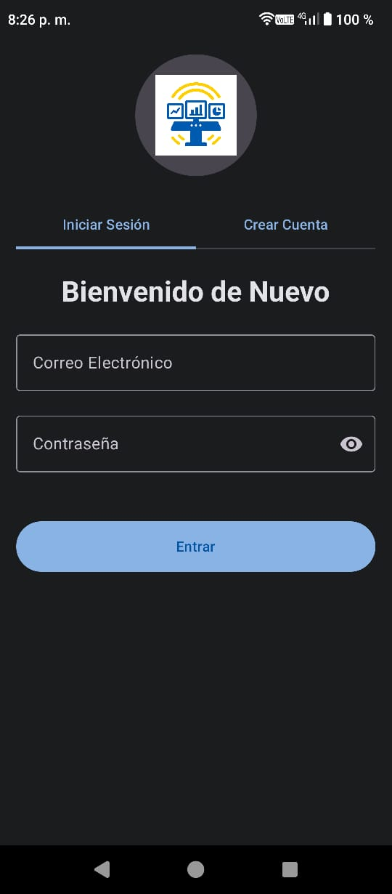
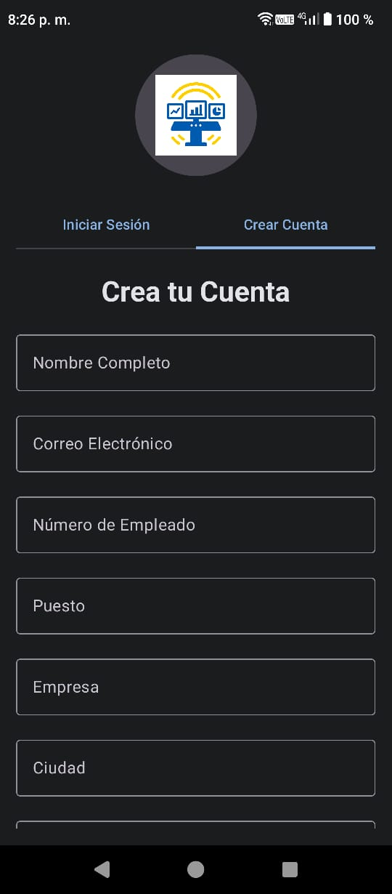
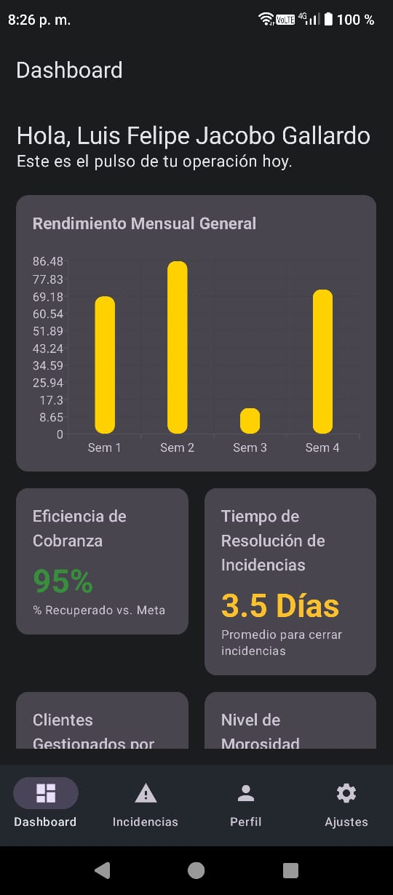
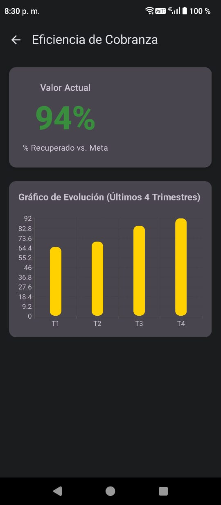
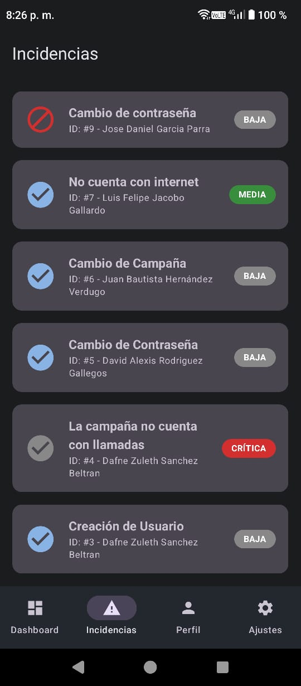
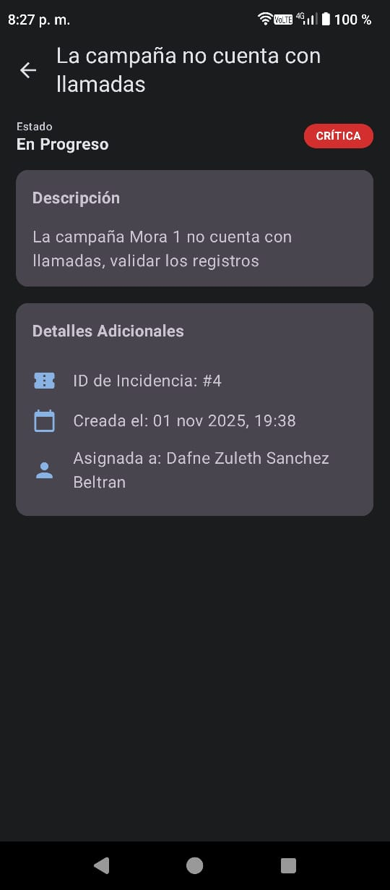
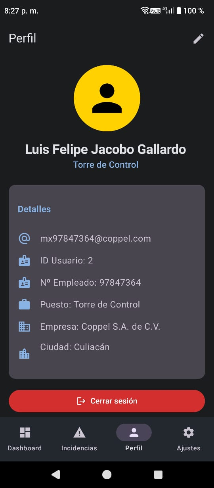
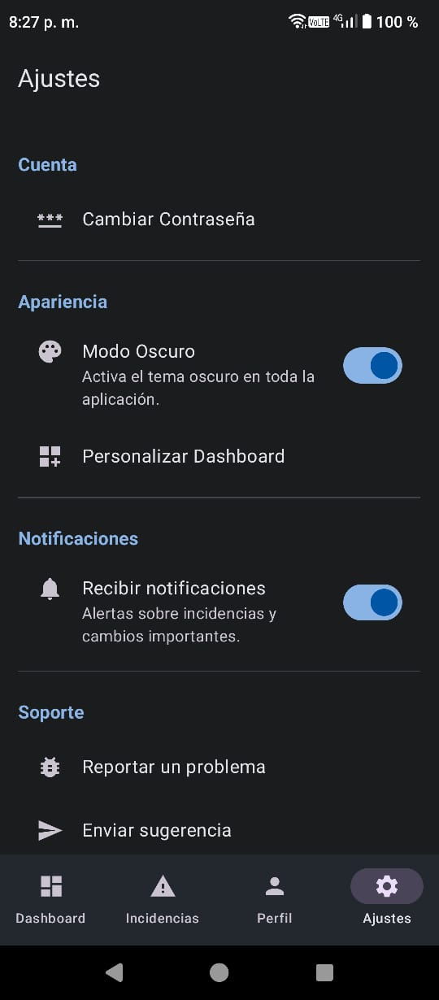

# 📊 Dashboard Móvil — Torre de Control en Cobranza

Aplicación móvil desarrollada en **Kotlin** con **Jetpack Compose** para **Coppel**, que centraliza en tiempo real los **indicadores clave (KPIs)** de la operación de cobranza. Diseñada para optimizar la supervisión y reducir los tiempos de respuesta ante incidencias críticas.

---

## 🎯 Valor del Proyecto

### 📈 **Problema Identificado**
Coppel, empresa del sector retail y financiero, maneja diariamente miles de operaciones de cobranza. Actualmente, la información sobre indicadores y alertas se encuentra dispersa en distintas plataformas, lo que retrasa la toma de decisiones y dificulta la gestión de incidencias.

### 🚀 **Solución Implementada**
**Centralización de información** en un dashboard móvil con actualizaciones automáticas, métricas visuales y accesibilidad desde cualquier lugar para supervisores y gestores.

---

## 🚀 Estado Actual del Proyecto

### ✅ **FUNCIONALIDADES IMPLEMENTADAS**
- **Sistema de autenticación y registro** con persistencia de sesión
- **Roles de usuario** (Administrador / Usuario) con permisos diferenciados
- **Formulario de registro extendido** (número de empleado, puesto, empresa, ciudad)
- **Pantalla de perfil enriquecida** con información laboral completa
- **Base de datos local** con Room y SQLite
- **Dashboard principal** con visualización de KPIs en tiempo real
- **Actualización automática** cada 5 segundos con datos simulados
- **Gráficas interactivas** con Vico Charts
- **Gestión de incidencias** con CRUD completo
- **Arquitectura reactiva** con ViewModels compartidos
- **Navegación modular** con Jetpack Navigation Compose
- **Inyección de dependencias** robusta con Hilt/Dagger

### 🛠️ **EN DESARROLLO**
- Optimización de rendimiento en carga inicial de datos
- Pruebas unitarias para ViewModels y Repositorios
- Ajustes visuales finales en temas y tipografía

---

## 🏗️ Arquitectura Técnica

### 🧩 **MVVM + Clean Architecture**

**UI Layer:** Jetpack Compose, State Hoisting, Material Design 3  
**Domain Layer:** StateFlow, Coroutines, ViewModels compartidos  
**Data Layer:** Patrón Repository, Room, DataStore, SQLite

---

## ⚙️ Stack Tecnológico

| Categoría | Tecnologías |
|-----------|-------------|
| 💙 **Lenguaje & Framework** | Kotlin, Jetpack Compose, Material Design 3 |
| 🏗️ **Arquitectura & Patrones** | MVVM, Clean Architecture, StateFlow, DI |
| 💾 **Persistencia de Datos** | Room, DataStore, SQLite |
| 🔄 **Programación Asíncrona** | Coroutines, Flow |
| 📊 **Visualización de Datos** | Vico Charts, Canvas de Compose |
| 💉 **Inyección de Dependencias** | Hilt/Dagger |

---

## 📚 Librerías y Dependencias Principales

Este proyecto utiliza **catálogo de versiones de Gradle (`libs.versions.toml`)** para gestión consistente de dependencias.

| Categoría | Librería | Versión | Propósito |
|-----------|----------|---------|-----------|
| **UI & Framework** | `androidx.compose.bom` | `2024.05.00` | Bill of Materials para Jetpack Compose |
| | `androidx.activity:activity-compose` | `1.9.0` | Integración con ciclo de vida |
| | `androidx.compose.material3` | `1.2.1` | Componentes Material Design 3 |
| **Arquitectura & Estado** | `androidx.lifecycle:lifecycle-runtime-ktx` | `2.8.0` | Gestión de ciclo de vida |
| | `androidx.lifecycle:lifecycle-viewmodel-compose` | `2.8.0` | ViewModels con Compose |
| | `kotlinx-coroutines-android` | `1.7.3` | Corrutinas en Android |
| **Navegación** | `androidx.navigation:navigation-compose` | `2.7.7` | Navegación declarativa |
| **Inyección Dependencias** | `com.google.dagger:hilt-android` | `2.50` | Hilt para DI |
| | `androidx.hilt:hilt-navigation-compose` | `1.2.0` | Integración Hilt + Navigation |
| **Base de Datos** | `androidx.room:room-runtime` & `room-ktx` | `2.6.1` | Room para persistencia |
| **Persistencia** | `androidx.datastore:datastore-preferences` | `1.1.1` | DataStore para preferencias |
| **Gráficas** | `com.patrykandpatrick.vico:vico-compose-m3` | `1.15.0` | Vico Charts para gráficas |
| **Documentos** | `com.itextpdf:itext7-android` | `8.0.2` | iText7 para generación PDF |

---

## 📈 KPIs Implementados

| Indicador | Estado | Tecnología | Frecuencia |
|-----------|--------|------------|------------|
| 💰 **Eficiencia de Cobranza** | ✅ Implementado | Vico Column Chart | Cada 5 seg |
| ⏱️ **Tiempo de Resolución** | ✅ Implementado | Room + Compose | Cada 5 seg |
| 👥 **Clientes Gestionados** | ✅ Implementado | Datos en UI | Cada 5 seg |
| 📉 **Nivel de Morosidad** | ✅ Implementado | Datos en UI | Cada 5 seg |
| 🎯 **Cumplimiento de Atención** | ✅ Implementado | Datos en UI | Cada 5 seg |
| 👥 **Satisfacción del Cliente** | ✅ Implementado | Datos en UI | Cada 5 seg |

---

## 🔐 Sistema de Roles

### 👨‍💼 **Administrador**
- Acceso completo a todas las funciones
- CRUD completo en gestión de incidencias
- Descarga de reportes en formato PDF
- Configuración del sistema

### 👥 **Usuario Estándar**
- Visualización de dashboards e indicadores
- Consulta de KPIs asignados
- Seguimiento de incidencias
- Acceso limitado a configuraciones

---

## 📱 Pantallas Principales

1. **Inicio de Sesión** → Autenticación con email y contraseña
2. **Registro de Usuario** → Creación de cuenta con datos personales y laborales
3. **Dashboard Principal** → Vista general de KPIs con semaforización
4. **Detalle de KPI** → Análisis específico con métricas detalladas
5. **Gestión de Incidencias** → CRUD completo para administradores
6. **Detalle de Incidencia** → Información específica y seguimiento
7. **Perfil de Usuario** → Datos personales, laborales y configuración
8. **Configuración** → Personalización de la aplicación

---

## 🧩 Ejemplo Visual

| Inicio de Sesión | Registro | Dashboard | Detalle KPI |
|:----------------:|:--------:|:---------:|:-----------:|
|  |  |  |  |

| Incidencias | Detalle Incidencia | Perfil | Ajustes |
|:-----------:|:------------------:|:------:|:-------:|
|  |  |  |  |

---

## 📲 Descargar APK

### 🎯 **Versión Actual: 1.0.2**

---

## 🧾 Requisitos del Sistema

### 🛠️ **Para Desarrollo**
- **Android Studio Giraffe** o superior
- **SDK Android API 23+** (Android 6.0+)
- **Kotlin 1.9+**
- **Gradle 8.0+**
- **JDK 17+**

### 📱 **Para Ejecución**
- **Dispositivo o emulador** con Android 6.0+
- **RAM mínima:** 2GB
- **Almacenamiento:** 50MB libres

---

## 🐛 Solución de Problemas Recientes

### ✅ **CORREGIDOS**

#### 🎨 **Mejoras de Interfaz y Usabilidad**
- **Legibilidad en Tema Claro:** Solucionado problema de texto casi invisible
- **Colores de Botones:** Corregida consistencia en botones de acción destructiva
- **Contraste en Diálogos:** Mejorado contraste de texto e iconos
- **Formulario Login/Registro:** Diseño corregido para coincidir con diseño original

#### 🚀 **Correcciones Técnicas**
- **Compatibilidad:** Solucionado error que impedía apertura en algunos dispositivos
- **Pantalla KPI:** Corregido bug visual que ocultaba valores numéricos
- **Formulario Incidencias:** Campo "Estado" ahora se muestra correctamente
- **Control de Accesos:** Usuarios no-administradores ya no ven botón de añadir incidencias

#### 🔧 **Optimizaciones de Código**
- **Referencias:** Solucionados errores de "Unresolved reference"
- **Estabilidad:** Mejorada gestión de estados y ciclo de vida de componentes

### 🔧 **EN PROCESO**
- Optimización de consultas a la base de datos
- Pruebas de estrés en sistema de actualización automática
- Compatibilidad con más tamaños de pantalla y densidades

---

## 🎯 Roadmap y Próximos Pasos

### 🚀 **Mejoras y Funcionalidades Futuras**
- **Integración con API REST** para datos en tiempo real (Flask, Node.js)
- **Exportación de Reportes** a formatos PDF y CSV
- **Notificaciones Push** para alertas críticas
- **Edición de Perfil de Usuario** para actualización de información
- **Multidioma** con soporte para español e inglés

### 📚 **Entregables y Documentación**
1. **Manual de Usuario** - `MANUAL_USUARIO.pdf`
2. **Anteproyecto** - `Anteproyecto.pdf` 

### 🗓️ **Hitos a Largo Plazo**
- **Q4 2025:** Versión estable 1.0 y despliegue inicial
- **Q1 2026:** Conexión con APIs de datos reales de Coppel
- **Q2 2026:** Desarrollo de panel web complementario

---

## 📞 Contacto y Soporte

**👤 Desarrollador:** Felipe Jacobo  
**🔗 GitHub:** [FelipeJacobo](https://github.com/FelipeJacobo)  
**📘 Proyecto:** [Dashboard-Torre-Control](https://github.com/FelipeJacobo/Dashboard-Torre-Control)  
**🐛 Reportar Issues:** [GitHub Issues](https://github.com/FelipeJacobo/Dashboard-Torre-Control/issues)

### 💬 **¿Necesitas ayuda?**
- **Documentación:** Revisa la carpeta `/docs`
- **Problemas técnicos:** Abre un issue en GitHub
- **Sugerencias:** Crea una discusión en el repositorio

---

**🕒 Última actualización:** 2 de noviembre de 2025
